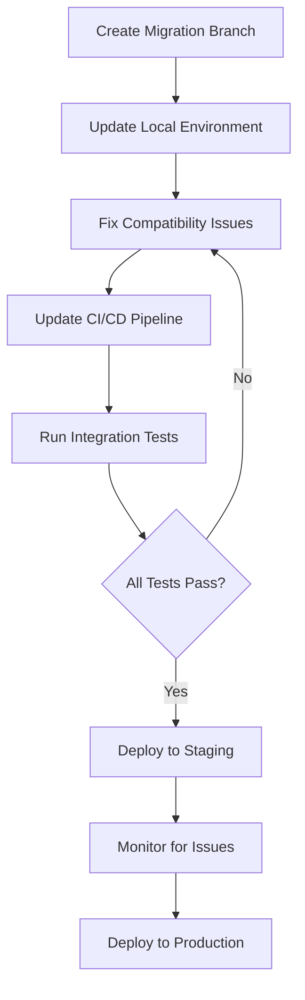

# Dependency Management Tutorial: A Real-World Scenario

*Based on actual dependency conflicts encountered in September 2025*

## Table of Contents
1. [Understanding the Problem](#understanding-the-problem)
2. [Diagnostic Tools & Commands](#diagnostic-tools--commands)
3. [The Decision Framework](#the-decision-framework)
4. [Strategy Patterns](#strategy-patterns)
5. [Real-World Case Study](#real-world-case-study)
6. [Planning for Node.js 20 Migration](#planning-for-nodejs-20-migration)

---

## Understanding the Problem

### The Dependency Ecosystem Challenge

Modern JavaScript/TypeScript projects have complex dependency trees where upgrading one package can break the entire chain:

```
Your Project (Node.js 18.19.1)
├── vitest@2.1.9
│   ├── requires Node.js >=18
│   └── 50+ sub-dependencies
├── commander@12.1.0  
│   └── requires Node.js >=12
└── @aws-sdk/client-lambda
    └── 200+ sub-dependencies
```

### Common Failure Scenarios

**Engine Version Conflicts**
```bash
ERR_PNPM_UNSUPPORTED_ENGINE  Unsupported environment (bad pnpm and/or Node.js version)
```

**Breaking API Changes**
- Major version bumps often introduce breaking changes
- Dependencies may have different Node.js version requirements
- CI/CD environments must align with local development

---

## Diagnostic Tools & Commands

### Essential Command Toolkit

```bash
# 1. Show direct dependencies only
pnpm list --depth=0

# 2. Check what versions are available
npm view <package> versions --json

# 3. Check engine requirements for specific version
npm view <package>@<version> engines

# 4. Find security vulnerabilities
pnpm audit

# 5. Check what's outdated
pnpm outdated

# 6. See dependency tree conflicts
pnpm list --depth=3 | grep -i conflict

# 7. Find packages with engine requirements
find . -name "package.json" -not -path "./node_modules/*" -exec grep -l "engines" {} \;

# 8. Check engine requirements across project
grep -A2 "engines" ./package.json ./aws-*/*/package.json
```

### Real Example Output

```bash
$ pnpm outdated
┌───────────────────┬─────────────────────────┬────────┐
│ Package           │ Current                 │ Latest │
├───────────────────┼─────────────────────────┼────────┤
│ @types/node (dev) │ 22.18.6 (wanted 24.5.2)│ 24.5.2 │
├───────────────────┼─────────────────────────┼────────┤
│ commander         │ 12.1.0                  │ 14.0.1 │
└───────────────────┴─────────────────────────┴────────┘
```

This immediately shows us potential upgrade conflicts.

---

## The Decision Framework

When facing dependency updates, ask these questions **in order**:

### Step 1: Is this a security issue?

```bash
pnpm audit --audit-level moderate
```

**If vulnerabilities found**: Prioritize security fixes over compatibility
**If clean**: You have time to make conservative choices

### Step 2: What are the breaking changes?

```bash
npm view commander@14.0.1 --json | jq -r '.engines'
# Output: { "node": ">=20" }
```

**Breaking change detected**: Requires Node.js 20+, but we're on 18.19.1

### Step 3: What's the cost of upgrading vs staying?

**Option A: Upgrade Node.js to 20+**
- ✅ Pro: Get latest features, better performance
- ❌ Con: Might break other dependencies, CI changes, testing overhead

**Option B: Stay on compatible versions**  
- ✅ Pro: Stable, no breaking changes
- ❌ Con: Miss some features, but not security updates

### Step 4: Risk Assessment

Check if Node.js upgrade would break other packages:
```bash
# Check all packages that specify engine requirements
find . -name "package.json" -not -path "./node_modules/*" -exec grep -A2 "engines" {} \;
```

---

## Strategy Patterns

Choose the right strategy based on your situation:

### Strategy A: Conservative (Recommended for Production)

**When to use:**
- No security vulnerabilities
- Complex monorepo setup
- Working CI/CD pipeline
- Limited time for debugging

**Implementation:**
```yaml
# .github/dependabot.yml
ignore:
  # Keep commander at v13.x to maintain Node.js 18 compatibility
  - dependency-name: "commander"
    versions: [">=14.0.0"]
  # Keep vitest at v2.x to avoid engine compatibility issues
  - dependency-name: "vitest"
    versions: [">=3.0.0"]
```

### Strategy B: Aggressive Upgrading

**When to use:**
- Security vulnerabilities present
- Simple project structure
- Dedicated time for testing

**Implementation:**
- Upgrade everything
- Fix breaking changes as they come
- Comprehensive testing required

### Strategy C: Staged Migration

**When to use:**
- Medium complexity project
- Planned major upgrade (like Node.js 20)
- Team has capacity for gradual migration

**Implementation:**
- Feature branch testing
- Gradual rollout
- Detailed compatibility matrix

---

## Real-World Case Study

### The Problem We Encountered

**September 2025**: Dependabot started creating failing PRs with `ERR_PNPM_UNSUPPORTED_ENGINE` errors.

**Root Causes:**
1. **Commander 14.0.1**: Required Node.js 20+, we were on 18.19.1
2. **Vitest 3.2.4**: Claimed Node.js 18 support but had engine conflicts

### Our Investigation Process

1. **Check security status**:
   ```bash
   $ pnpm audit
   No known vulnerabilities found
   ```
   ✅ **Result**: No urgency, can be conservative

2. **Analyze breaking changes**:
   ```bash
   $ npm view commander@14.0.1 engines
   { node: '>=20' }
   
   $ npm view vitest@3.2.4 engines  
   { node: '^18.0.0 || ^20.0.0 || >=22.0.0' }
   ```
   ❌ **Result**: Commander definitely breaks, Vitest theoretically works but has issues

3. **Check our constraints**:
   ```bash
   $ grep -A2 "engines" ./package.json ./aws-*/*/package.json
   # All specify: "node": ">=18.19.1"
   ```
   ✅ **Result**: Our packages are flexible, but CI is locked to 18.19.1

### Our Solution (Strategy A: Conservative)

We chose to ignore problematic major versions:

```yaml
ignore:
  # Keep commander at v13.x to maintain Node.js 18 compatibility
  - dependency-name: "commander"
    versions: [">=14.0.0"]
  # Keep vitest at v2.x to avoid engine compatibility issues
  - dependency-name: "vitest"
    versions: [">=3.0.0"]
  - dependency-name: "@vitest/coverage-v8"
    versions: [">=3.0.0"]
  - dependency-name: "@vitest/ui"
    versions: [">=3.0.0"]
```

**Results:**
- ✅ Stopped failing Dependabot PRs
- ✅ Maintained stable CI/CD pipeline
- ✅ Manually upgraded commander 12.1.0 → 13.1.0 (Node.js 18 compatible)
- ✅ Kept system running without disruption

### Key Lessons Learned

1. **Not all "compatible" versions actually work** - Vitest 3.x claimed Node.js 18 support but failed
2. **Conservative choices prevent cascading failures** - One broken dependency can break your entire pipeline
3. **Manual upgrades within compatible ranges** - We safely went commander 12→13, avoiding the 14+ breakage
4. **Documentation prevents repeat mistakes** - Hence this tutorial!

---

## Planning for Node.js 20 Migration

### Why Migration Will Be Necessary

**AWS Lambda Runtime Schedule:**
- Node.js 18: Support until ~2026
- Node.js 20: Current recommended version
- Node.js 22: Already available

**Kubernetes/EKS Node Images:**
- Regular deprecation of older Node.js versions
- Security updates concentrate on newer versions

### Migration Planning Checklist

#### Phase 1: Assessment (Do This Now)

```bash
# 1. Create dependency compatibility matrix
npm view commander@14 engines  # Check latest versions
npm view vitest@3 engines
npm view @aws-sdk/client-lambda engines

# 2. Check AWS Lambda runtime compatibility
# Visit: https://docs.aws.amazon.com/lambda/latest/dg/lambda-nodejs.html

# 3. Check EKS/Kubernetes node image support
# Visit: https://github.com/awslabs/amazon-eks-ami/releases

# 4. Audit current dependencies for Node.js 20 readiness
pnpm list --depth=1 | grep -v "node_modules"
```

#### Phase 2: Staged Testing (Future Sprint)

1. **Create Node.js 20 test branch**:
   ```bash
   git checkout -b feature/node-20-migration
   ```

2. **Update engine requirements**:
   ```json
   {
     "engines": {
       "node": ">=20.0.0",
       "pnpm": ">=10.14.0"
     }
   }
   ```

3. **Update CI workflow**:
   ```yaml
   # .github/workflows/ci.yml
   env:
     NODE_VERSION: '20.18.0'
     PNPM_VERSION: '10.14.0'
   ```

4. **Remove Dependabot ignores**:
   ```yaml
   # Remove these from .github/dependabot.yml
   # - dependency-name: "commander"
   #   versions: [">=14.0.0"]
   ```

5. **Test systematically**:
   ```bash
   pnpm install         # Check for engine conflicts
   pnpm run build       # Verify builds work
   pnpm run test        # Run full test suite
   pnpm run lint        # Check linting still works
   ```

#### Phase 3: Rollout Strategy



### Migration Timing Recommendations

**Ideal Timing:**
- ✅ Between major feature releases
- ✅ When team has capacity for debugging
- ✅ Before AWS deprecates Node.js 18 in Lambda

**Avoid Migration During:**
- ❌ Active feature development sprints
- ❌ Holiday periods with reduced team capacity
- ❌ Major production deployments

### Rollback Plan

Always have a rollback strategy:

1. **Git branches**: Keep Node.js 18 branch available
2. **CI/CD**: Maintain parallel pipelines during transition
3. **Dependencies**: Document exact working versions
4. **Infrastructure**: Ensure both Node.js versions work in deployment environments

---

## Best Practices Summary

### DO ✅
- **Always check security status first** (`pnpm audit`)
- **Use `pnpm outdated` to understand what's changing**
- **Check engine requirements before upgrading** (`npm view package@version engines`)
- **Test upgrades in feature branches**
- **Document your dependency strategy decisions**
- **Use Dependabot ignore rules strategically**
- **Keep CI and local environments aligned**

### DON'T ❌
- **Don't upgrade everything at once without testing**
- **Don't ignore engine version conflicts**
- **Don't assume "compatible" versions actually work**
- **Don't skip security updates for convenience**
- **Don't upgrade Node.js major versions in production without thorough testing**
- **Don't forget to update CI/CD pipelines with Node.js changes**

### Emergency Procedures

**If Dependabot PRs start failing:**
1. Check error messages for `ERR_PNPM_UNSUPPORTED_ENGINE`
2. Identify which package is causing the conflict
3. Add temporary ignore rule to Dependabot config
4. Create feature branch to test upgrade path
5. Document the issue and plan proper fix

**If production builds break:**
1. Revert to last known working commit
2. Check if Node.js version changed in CI
3. Verify package-lock.json/pnpm-lock.yaml integrity
4. Test in isolated environment before redeploying

---

## Conclusion

Dependency management is about **risk management**. The goal isn't to have the newest versions of everything - it's to have a **stable, secure, maintainable** system that delivers value to users.

Choose conservative strategies when you're delivering features. Plan major upgrades when you have dedicated time and team capacity. Always prioritize security updates, but don't let "keeping up" with the latest versions distract from building great software.

**Remember**: A working system with slightly older dependencies is infinitely better than a broken system with the latest everything.

---

*Last updated: September 2025 - Based on CloudProjects monorepo dependency management experience*