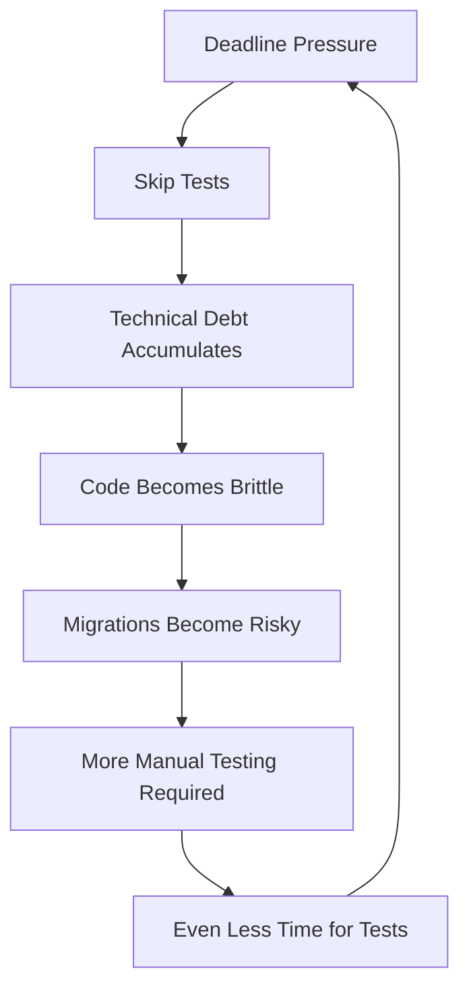
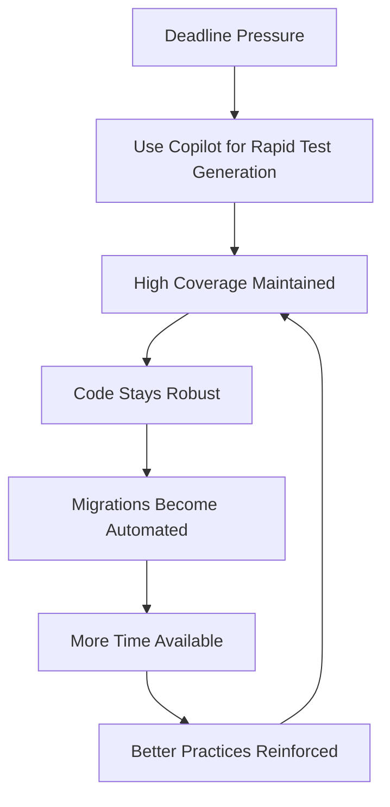

# Node.js 20 Compatibility Matrix

*Assessment for CloudProjects monorepo migration*

## Current Status: Node.js 18.19.1

| Package | Current Dependencies | Node 20 Ready? | Blockers | Action Needed |
|---------|---------------------|----------------|----------|---------------|
| **Root Workspace** | | | | |
| TypeScript 5.9.2 | ✅ | Yes | None | None |
| ESLint 9.36.0 | ✅ | Yes | None | None |
| aws-cdk-lib 2.217.0 | 🔍 | TBD | TBD | Test required |
| | | | | |
| **list-lambdas** | | | | |
| commander 13.1.0 | ❌ | No | Needs v14+ | Upgrade after Node 20 |
| vitest 2.1.9 | ❌ | No | Needs v3+ | Upgrade after Node 20 |
| @aws-sdk/client-lambda 3.896.0 | 🔍 | TBD | TBD | Test required |
| | | | | |
| **list-pods** | | | | |
| commander 13.1.0 | ❌ | No | Needs v14+ | Upgrade after Node 20 |
| vitest 2.1.9 | ❌ | No | Needs v3+ | Upgrade after Node 20 |
| | | | | |
| **eks** | | | | |
| aws-cdk-lib 2.217.0 | 🔍 | TBD | TBD | Test required |

## Migration Strategy

### Phase 1: Compatibility Testing (Current)
- [ ] Test each package individually with Node.js 20
- [ ] Identify breaking changes
- [ ] Document required dependency upgrades

### Phase 2: Preparation (Before Migration)
- [ ] Update dependencies that require Node.js 20
- [ ] Remove Dependabot ignore rules for compatible packages
- [ ] Update package.json engines to ">=18.19.1 || >=20.0.0"

### Phase 3: Migration (Single Event)
- [ ] Update CI/CD to Node.js 20
- [ ] Update all local development environments
- [ ] Deploy to staging with Node.js 20
- [ ] Monitor and fix any remaining issues
- [ ] Deploy to production

## The "Gradual Migration" Challenge

### Why Traditional Gradual Upgrades Don't Work in Monorepos

**The Question:** "Can we upgrade Node.js version gradually in a monorepo?"

**The Reality:** Node.js version upgrades are inherently **"all-or-nothing"** in monorepos because the runtime environment is shared across the entire codebase.

```
CloudProjects/ (Single Node.js Runtime)
├── aws-cdk-examples/eks/     ← All use same Node.js version
├── aws-sdk-examples/list-lambdas/ ← Can't have different versions
├── aws-sdk-examples/list-pods/    ← Single package.json engines
└── package.json (engines: node >=18.19.1)
```

**Technical Constraints:**
- ✅ One `node_modules` tree (PNPM workspace)
- ✅ One CI/CD environment 
- ✅ One development environment
- ❌ Cannot run different Node.js versions simultaneously

### What "Gradual" Actually Means in Monorepos

Instead of gradual **runtime** migration, you do gradual **compatibility** preparation:

**❌ What you CAN'T do:**
- Run package A on Node.js 18 while package B runs on Node.js 20
- Migrate one package at a time to different Node.js versions
- Have different CI environments for different packages

**✅ What you CAN do:**
- Gradual **testing** and preparation of each package
- Gradual **rollout** across environments (dev → staging → prod)
- Gradual **confidence building** through systematic testing
- Gradual **dependency preparation** for Node.js 20 compatibility

## Key Insights

**Cannot be gradual because:**
- Single Node.js runtime per monorepo
- Shared node_modules and lockfile
- Single CI/CD environment

**"Gradual" means:**
- Gradual preparation and testing
- Single migration event
- Gradual rollout to environments (dev → staging → prod)

## Alternative Strategies for "Gradual" Migration

### Option A: Staged Big Bang (Recommended)
**Week 1-2: Preparation Phase**
```bash
# Test each package individually
nvm install 20
nvm use 20

cd aws-sdk-examples/list-lambdas
pnpm install  # See what breaks
pnpm test     # Check if tests pass
pnpm build    # Verify builds work
```

**Week 3: Pre-migration Setup**
```bash
# Update package.json to allow both versions
"engines": {
  "node": ">=18.19.1 || >=20.0.0"
}

# Remove Dependabot ignores for Node 20 compatible packages
# Update CI to test against both Node 18 and 20 in matrix
```

**Week 4: Migration Day**
```bash
# Single coordinated update:
# 1. Update CI to Node.js 20
# 2. Update all developer environments
# 3. Update dependencies that required Node.js 20
# 4. Deploy to staging
# 5. Monitor, then deploy to production
```

### Option B: Environment-Based Gradual Rollout
```bash
# Different environments run different Node.js versions temporarily
Development: Node.js 20 (developers test)
CI/CD: Node.js 18 → 20 (feature flag controlled)
Staging: Node.js 20 (integration testing)  
Production: Node.js 18 → 20 (blue/green deployment)
```

### Option C: Package Extraction (Nuclear Option)
```bash
# Extract problematic packages to separate repos
CloudProjects/ (Node.js 20)
├── aws-cdk-examples/
└── aws-sdk-examples/ → Separate repo (Node.js 18 temporarily)
```

### Option D: Docker-Based Multi-Version (Complex)
```dockerfile
# Different services use different base images
FROM node:18-alpine AS legacy-services
FROM node:20-alpine AS modern-services
```

## Advanced Migration Scenarios

### The "Active Development + Migration Prep" Challenge

**Real-World Scenario:** Your team is actively shipping features while also needing to prepare for Node.js 20 migration. How do you balance both without disrupting either?

### Option E: Fork-Based Migration Testing (Parallel Development)

This approach uses a **dedicated migration fork** that stays synchronized with the main repository:

```
Main Repository (Node.js 18)          Migration Fork (Node.js 20)
├── main branch (production)    ←→    ├── main branch (Node 20 testing)
├── feature/user-auth                  ├── feature/user-auth (cherry-picked)
├── feature/new-dashboard              ├── migration/dependency-upgrades
└── Active development continues       └── Node 20 compatibility work
```

#### Implementation Strategy:

**1. Create Migration Fork**
```bash
# On GitHub, fork your repository to: username/CloudProjects-node20
git clone https://github.com/username/CloudProjects-node20
cd CloudProjects-node20

# Set up upstream to sync with main repo
git remote add upstream https://github.com/davidxjohnson/CloudProjects
```

**2. Configure Node.js 20 Environment**
```bash
# In the fork, immediately upgrade to Node 20
# Update .github/workflows/ci.yml
env:
  NODE_VERSION: '20.18.0'
  PNPM_VERSION: '10.14.0'

# Update all package.json engines
"engines": {
  "node": ">=20.0.0"
}

# Remove Dependabot ignore rules
# Update dependencies to Node 20 compatible versions
```

**3. Synchronization Workflow**
```bash
# Daily sync from main repository
git fetch upstream
git checkout main
git rebase upstream/main

# Cherry-pick important features from main repo
git cherry-pick <commit-hash-from-main>

# Or merge specific branches
git checkout -b feature/user-auth upstream/feature/user-auth
# Test with Node 20, fix any issues
```

**4. Continuous Integration Setup**
```yaml
# .github/workflows/sync-and-test.yml in migration fork
name: Sync and Test with Node 20
on:
  schedule:
    - cron: '0 2 * * *'  # Daily at 2 AM
  workflow_dispatch:

jobs:
  sync-and-test:
    runs-on: ubuntu-latest
    steps:
      - name: Sync with upstream
        run: |
          git fetch upstream
          git rebase upstream/main
      
      - name: Test with Node 20
        uses: actions/setup-node@v3
        with:
          node-version: '20.18.0'
      
      - name: Run full test suite
        run: |
          pnpm install
          pnpm run test
          pnpm run build
```

#### Advantages of Fork-Based Approach:

✅ **Parallel development**: Main repo continues normal feature work
✅ **Isolated testing**: Node 20 issues don't block production features  
✅ **Selective sync**: Cherry-pick only the features you want to test
✅ **Full environment**: Complete CI/CD pipeline testing with Node 20
✅ **Rollback safety**: Main repo remains untouched until migration ready
✅ **Team flexibility**: Some developers can work on migration, others on features

#### Disadvantages:

❌ **Maintenance overhead**: Keeping fork synchronized requires discipline
❌ **Merge conflicts**: Features may conflict when cherry-picked
❌ **Testing gap**: Not all combinations tested until final merge
❌ **Documentation drift**: Need to keep both repos' docs in sync

### Alternative: Branch-Based Migration Testing

If forking feels too heavy, use a **long-running migration branch**:

```
CloudProjects Repository
├── main (Node.js 18)
│   ├── feature/user-auth
│   └── feature/new-dashboard
├── migration/node-20 (Node.js 20)
│   ├── Regularly merges from main
│   ├── Node 20 compatibility fixes
│   └── Dependency upgrades
```

```bash
# Create long-running migration branch
git checkout -b migration/node-20

# Configure for Node 20
# Update CI, package.json, dependencies

# Regular syncing with main
git checkout migration/node-20
git merge main
# Fix any conflicts, test with Node 20
```

### Recommended Workflow for Your Scenario

Given your CloudProjects setup, I'd recommend the **Fork-Based Approach** because:

1. **Clean separation**: Production development unaffected
2. **Full testing**: Complete CI/CD validation with Node 20
3. **Gradual confidence**: Build confidence over time
4. **Easy rollback**: Can abandon fork if issues arise

#### Implementation Timeline:

**Week 1: Fork Setup**
- Create migration fork
- Configure Node.js 20 CI/CD
- Update engines and dependencies
- Establish sync workflow

**Weeks 2-4: Parallel Development**
- Main repo: Continue feature development
- Fork: Daily sync + Node 20 compatibility fixes
- Cherry-pick critical features for testing

**Week 5+: Validation & Merge**
- Full integration testing in fork
- Performance benchmarking
- When confident, merge fork back to main
- Delete migration fork

#### Sync Automation Script:
```bash
#!/bin/bash
# scripts/sync-migration-fork.sh
set -e

echo "Syncing migration fork with main repository..."

# Fetch latest from main repo
git fetch upstream

# Get current branch
CURRENT_BRANCH=$(git branch --show-current)

# Switch to main and sync
git checkout main
git rebase upstream/main

# Push updated main to fork
git push origin main

# Return to working branch
git checkout $CURRENT_BRANCH

# Merge updated main into current branch
git merge main

echo "Migration fork synced successfully!"
```

### Managing Configuration Divergence

**The Challenge:** Fork needs different configurations (Node.js 20, updated dependencies) while sharing the same codebase.

#### Files That Should **NEVER** Sync from Main → Fork:

Create a **`.sync-ignore`** strategy for these files:

```bash
# Files that stay different between main and fork
.github/workflows/ci.yml           # Different Node.js versions
package.json                       # Different engines, dependencies
*/package.json                     # Package-level configurations
pnpm-lock.yaml                     # Different dependency resolutions
.github/dependabot.yml             # Different ignore rules
.nvmrc                             # Node version specification
```

#### Advanced Sync Script with Selective Exclusion:

```bash
#!/bin/bash
# scripts/smart-sync-migration-fork.sh
set -e

SYNC_IGNORE_FILE=".sync-ignore"
UPSTREAM_REMOTE="upstream"
FORK_CONFIG_BRANCH="fork-config-only"

echo "🔄 Starting smart sync with configuration preservation..."

# Backup fork-specific configurations
echo "📦 Backing up fork-specific configurations..."
git checkout -b temp-config-backup

# Create list of files to preserve
PRESERVE_FILES=(
  ".github/workflows/ci.yml"
  "package.json" 
  "*/package.json"
  "pnpm-lock.yaml"
  ".github/dependabot.yml"
  ".nvmrc"
)

# Backup these files
mkdir -p .config-backup
for pattern in "${PRESERVE_FILES[@]}"; do
  find . -path "./node_modules" -prune -o -name "$pattern" -type f -exec cp {} .config-backup/ \; 2>/dev/null || true
done

# Sync with upstream
echo "🔄 Syncing code from main repository..."
git fetch $UPSTREAM_REMOTE
git checkout main
git rebase $UPSTREAM_REMOTE/main

# Restore fork-specific configurations
echo "🔧 Restoring fork-specific configurations..."
cp .config-backup/* . 2>/dev/null || true

# Clean up
rm -rf .config-backup
git branch -D temp-config-backup 2>/dev/null || true

echo "✅ Smart sync completed - code updated, configurations preserved!"
```

#### Files That **SHOULD** Sync Bidirectionally:

**Main → Fork (Always sync):**
```bash
# Business logic and features
src/                    # All source code
lib/                    # Compiled libraries  
docs/ (except migration docs)  # Documentation
README.md               # Project documentation
scripts/ (except sync scripts) # Utility scripts
tests/                  # Test suites
```

**Fork → Main (Conditional sync):**
```bash
# Code that works on both Node 18 and 20
src/                    # Bug fixes, new features
lib/                    # Library improvements
tests/                  # New or improved tests
docs/                   # Documentation improvements

# Process: Test in fork first, then PR to main
```

### Bidirectional Sync Strategy

#### Workflow for Code That Benefits Both Versions:

**1. Feature Development in Fork (Node.js 20 Testing)**
```bash
# In migration fork
git checkout -b feature/user-authentication
# Develop feature, test with Node.js 20
git commit -m "feat: add user authentication system"

# Test compatibility - does it work on Node.js 20?
pnpm test  # ✅ Passes on Node.js 20
```

**2. Compatibility Testing on Node.js 18**
```bash
# Quick local test (if you have Node.js 18 available)
nvm use 18
pnpm install
pnpm test  # ✅ Also passes on Node.js 18

# OR create a test PR in main repo to validate CI
```

**3. Sync Back to Main Repository**
```bash
# Create PR in main repository
gh pr create --repo davidxjohnson/CloudProjects \
  --title "feat: add user authentication system" \
  --body "Feature developed and tested in Node.js 20 migration fork.
  
  ✅ Passes tests on Node.js 20
  ✅ Compatible with Node.js 18
  ✅ No breaking changes to existing APIs"

# After merge, sync back to fork
git fetch upstream
git rebase upstream/main
```

### Configuration Management Patterns

#### Pattern 1: Environment-Specific Configuration Files

```bash
# Main repository
.github/workflows/ci.yml          # Node.js 18
package.json                      # Node 18 engines

# Migration fork  
.github/workflows/ci.yml          # Node.js 20
package.json                      # Node 20 engines
```

#### Pattern 2: Template-Based Configuration

Create **template files** that get customized per environment:

```bash
# Shared template
.github/workflows/ci.template.yml

# Environment-specific values
.github/config/node18.env
.github/config/node20.env

# Build script generates actual ci.yml from template + environment
```

#### Pattern 3: Feature Flags in Configuration

```json
// package.json (both repos)
{
  "engines": {
    "node": ">=18.19.1"  // Main repo
    "node": ">=20.0.0"   // Fork repo  
  },
  "scripts": {
    "test": "vitest run",
    "test:node20": "vitest run --config vitest.node20.config.ts"
  }
}
```

### Practical Example: Dependency Upgrade Flow

**Scenario:** Vitest 3.x upgrade that requires Node.js 20

**In Migration Fork:**
```bash
# Remove Dependabot ignore rules
# .github/dependabot.yml - remove vitest ignores

# Update package.json
"devDependencies": {
  "vitest": "^3.2.4",
  "@vitest/coverage-v8": "^3.2.4"
}

# Test the upgrade
pnpm install
pnpm test  # ✅ Works with Node.js 20!
```

**Code Changes That Work on Both:**
```typescript
// src/test-utils.ts - New test utilities that work on both versions
export function createMockLambda() {
  // Implementation that's compatible with both vitest 2.x and 3.x
}
```

**Sync Back to Main:**
```bash
# Only sync the compatible code, not the vitest upgrade
git checkout feature/improved-test-utils
git add src/test-utils.ts
git commit -m "feat: add improved test utilities"

# Create PR to main (will use vitest 2.x there)
gh pr create --repo davidxjohnson/CloudProjects \
  --title "feat: improve test utilities"
```

### Automation Tools

#### GitHub Actions for Smart Sync:

```yaml
# .github/workflows/smart-sync.yml (in migration fork)
name: Smart Sync with Main
on:
  schedule:
    - cron: '0 2 * * *'  # Daily
  workflow_dispatch:

jobs:
  smart-sync:
    runs-on: ubuntu-latest
    steps:
      - uses: actions/checkout@v3
        with:
          fetch-depth: 0
          
      - name: Setup upstream remote
        run: |
          git remote add upstream https://github.com/davidxjohnson/CloudProjects
          
      - name: Run smart sync
        run: ./scripts/smart-sync-migration-fork.sh
        
      - name: Create PR if changes
        run: |
          if [[ -n $(git status --porcelain) ]]; then
            git checkout -b auto-sync-$(date +%Y%m%d)
            git commit -am "chore: auto-sync from main repository"
            gh pr create --title "Auto-sync from main" --body "Automated sync"
          fi
```

This approach gives you **surgical precision** - sync the code you want while maintaining the configuration differences you need.

---

## The Critical Success Factor: Test Coverage

### Why Test Coverage is MANDATORY for Node.js Migration

**The Hard Truth:** Without comprehensive test coverage, Node.js migration becomes a **massive manual testing operation** with high risk of production failures.

#### The Developer Reality Problem

**Common Scenario Under Pressure:**
```bash
# What happens when deadlines loom
Developer: "We need to ship this feature by Friday"
Manager: "Skip the tests for now, we'll add them later"
Result: Technical debt accumulates, migration becomes impossible
```

**The Compounding Effect:**
- **Happy-path code**: Relatively straightforward to write
- **Test code**: 2-3x more complex (mocking, edge cases, async handling)
- **Under pressure**: Tests get deprioritized
- **Migration time**: No confidence in Node.js compatibility

#### Real-World Migration Confidence Matrix

| Test Coverage | Migration Confidence | Manual Testing Effort | Risk Level |
|---------------|---------------------|----------------------|------------|
| **< 30%** | ❌ Very Low | 🔴 Massive (weeks) | 🔴 Extremely High |
| **30-60%** | ⚠️ Low | 🟡 Substantial (days) | 🟡 High |
| **60-80%** | ✅ Good | 🟢 Manageable (hours) | 🟢 Medium |
| **> 80%** | ✅ High | 🟢 Minimal (automated) | 🟢 Low |

### How AI/Copilot Transforms This Challenge

#### Traditional Test Writing (Painful)
```typescript
// Manual test writing - slow, error-prone
describe('LambdaLister', () => {
  it('should handle pagination correctly', () => {
    // Developer spends 2 hours figuring out mocking
    // Gets frustrated, writes minimal test
    // Covers only happy path
  });
});
```

#### AI-Assisted Test Generation (Game Changer)
```typescript
// Copilot prompt: "Generate comprehensive tests for LambdaLister class"
describe('LambdaLister', () => {
  let mockLambdaClient: jest.Mocked<LambdaClient>;
  let lambdaLister: LambdaLister;

  beforeEach(() => {
    mockLambdaClient = {
      send: jest.fn(),
    } as any;
    lambdaLister = new LambdaLister(mockLambdaClient);
  });

  describe('listLambdas', () => {
    it('should handle single page results', async () => { /* ... */ });
    it('should handle pagination with NextMarker', async () => { /* ... */ });
    it('should handle empty results', async () => { /* ... */ });
    it('should handle AWS SDK errors', async () => { /* ... */ });
    it('should handle network timeouts', async () => { /* ... */ });
    it('should validate input parameters', async () => { /* ... */ });
  });
});
```

**Copilot Benefits:**
- ✅ **Comprehensive coverage**: Generates edge cases you'd forget
- ✅ **Proper mocking**: Handles complex AWS SDK mocking patterns
- ✅ **Error scenarios**: Tests failure paths developers often skip
- ✅ **Speed**: Minutes instead of hours per test suite

### Test-Driven Migration Strategy

#### Phase 1: Pre-Migration Test Audit
```bash
# Assess current test coverage
pnpm run test:coverage

# Target coverage levels for safe migration:
# - Critical paths: 100% coverage
# - Business logic: 90%+ coverage  
# - Integration points: 80%+ coverage
# - Utility functions: 95%+ coverage
```

#### Phase 2: AI-Assisted Test Enhancement
```bash
# Use Copilot to rapidly improve coverage
# For each undertested module:

# 1. Prompt: "Generate comprehensive unit tests for [ModuleName]"
# 2. Prompt: "Add error handling tests for [FunctionName]" 
# 3. Prompt: "Create integration tests for [APIEndpoint]"
# 4. Run tests, fix any failures
# 5. Achieve target coverage before migration
```

#### Phase 3: Migration with Confidence
```bash
# Migration fork testing becomes automated
pnpm run test          # ✅ All tests pass on Node.js 20
pnpm run test:coverage # ✅ Coverage maintained
pnpm run test:integration # ✅ End-to-end validation

# Manual testing reduced from weeks to hours
```

### The Technical Debt Reality

#### Why Teams Skip Tests (The Vicious Cycle)


#### Breaking the Cycle with AI


### Copilot Best Practices for Migration Testing

#### 1. Test Generation Prompts That Work
```typescript
// Effective Copilot prompts:

// "Generate comprehensive unit tests for this AWS Lambda function including error cases"
// "Create integration tests for this API endpoint with mocked dependencies"
// "Add parametrized tests for this utility function with edge cases"
// "Generate tests for this async function including timeout scenarios"
```

#### 2. Code Quality Benefits
**Separation of Concerns:**
```typescript
// Copilot-generated tests naturally encourage better design
// Before: Monolithic function hard to test
function processLambdas() {
  // 50 lines of mixed concerns
}

// After: Modular design for testability  
class LambdaProcessor {
  async fetchLambdas() { /* ... */ }
  filterByPattern(lambdas: Lambda[]) { /* ... */ }
  formatResults(filtered: Lambda[]) { /* ... */ }
}
```

**Modularity:**
```typescript
// Copilot tests reveal tight coupling, encouraging refactoring
// Each function becomes independently testable
// Mock interfaces become clear
// Dependencies become explicit
```

### Migration Success Metrics

#### Before Migration (Test Coverage Checklist)
```bash
✅ Unit test coverage > 80%
✅ Integration test coverage > 70%
✅ Critical path coverage = 100%
✅ Error handling tests for all external dependencies
✅ Performance benchmarks established
✅ All tests pass on both Node.js 18 and 20 (in fork)
```

#### During Migration
```bash
✅ Automated test suite runs in < 5 minutes
✅ Zero manual testing required for basic functionality
✅ Rollback plan tested and verified
✅ Performance regression tests included
```

#### After Migration Success Validation
```bash
✅ All tests pass on Node.js 20 in production
✅ Performance metrics within acceptable ranges  
✅ Error rates unchanged or improved
✅ Team confidence in future migrations increased
```

### The Investment vs. Risk Equation

**Short-term Investment (with AI assistance):**
- 📅 **Time**: 1-2 weeks for comprehensive test enhancement
- 💰 **Cost**: Developer time + AI tooling
- 🎯 **Effort**: Focused test generation and validation

**Long-term Risk Mitigation:**
- 📅 **Time Saved**: Weeks of manual testing eliminated
- 💰 **Cost Avoided**: Production bug fixes, rollback costs, reputation damage
- 🎯 **Benefits**: Confident migrations, better code quality, team velocity

### Key Insight: Tests as Migration Insurance

**Without Tests:**
```bash
Node.js Migration = Leap of Faith + Manual Testing Marathon + High Stress
```

**With AI-Generated Comprehensive Tests:**
```bash
Node.js Migration = Automated Validation + Confidence + Smooth Deployment
```

The investment in AI-assisted test coverage transforms Node.js migration from a **high-risk manual operation** into a **confident automated process**.

This approach gives you the **best of both worlds**: active development continues unimpeded while you systematically prepare for Node.js 20 migration with full confidence testing.

## Decision Points

### Option A: Big Bang Migration
**When:** All packages tested and compatible
**Risk:** High (everything changes at once)
**Benefit:** Fast, clean cut

### Option B: Package Extraction
**When:** Some packages have incompatible dependencies
**Risk:** Medium (complexity of separate repos)
**Benefit:** True gradual migration possible

### Option C: Version Matrix Testing
**When:** Uncertain compatibility
**Risk:** Low (thorough testing)
**Benefit:** High confidence migration